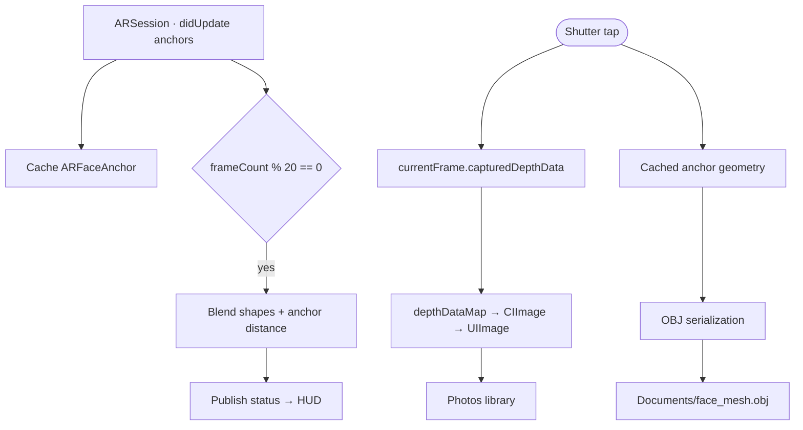

<div align="center">

# ARFaceDumper

**Real-time facial capture, mesh export and depth acquisition for iOS.**

[](https://developer.apple.com/ios/)
[](https://swift.org)
[](https://developer.apple.com/augmented-reality/arkit/)
[](LICENSE)

</div>

---

## Table of Contents

- [Overview](#overview)
- [Features](#features)
- [Requirements](#requirements)
- [Installation](#installation)
- [Configuration](#configuration)
- [Usage](#usage)
- [Output Artifacts](#output-artifacts)
- [Architecture](#architecture)
- [Tracked Blend Shapes](#tracked-blend-shapes)
- [Project Structure](#project-structure)
- [Testing](#testing)
- [Limitations & Roadmap](#limitations--roadmap)
- [Contributing](#contributing)
- [License](#license)

---

## Overview

ARFaceDumper is an iOS application built on **ARKit Face Tracking** that streams facial geometry and expression data from the TrueDepth camera in real time. It surfaces live tracking telemetry on screen and, on demand, dumps two artifacts to disk: a **Wavefront OBJ** file containing the reconstructed face mesh, and the raw **depth map** captured by the sensor.

---

## Features

| Capability | Description |
| --- | --- |
| **Real-time face tracking** | `ARFaceTrackingConfiguration` driving a RealityKit `ARView` hosted inside SwiftUI via `UIViewRepresentable`. |
| **Live telemetry HUD** | Monospaced overlay refreshed every 20 frames with vertex count, face distance and expression states. |
| **Repositionable overlay** | The HUD can be dragged anywhere on screen and retains its position between gestures. |
| **One-tap capture** | A camera-style shutter button triggers depth-map and mesh export in a single action. |
| **OBJ mesh export** | Writes vertices (`v`), texture coordinates (`vt`) and triangle faces (`f v/vt`) derived from `ARFaceGeometry`. |
| **Depth map capture** | Converts `capturedDepthData.depthDataMap` into an image and saves it to the Photos library. |
| **On-device file access** | `UIFileSharingEnabled` and `LSSupportsOpeningDocumentsInPlace` expose exported meshes through Finder and the Files app. |

---

## Requirements

| Requirement | Value |
| --- | --- |
| Hardware | Device with a TrueDepth camera (iPhone X or newer, iPad Pro with Face ID) |
| Deployment target | iOS 26.2 |
| Language | Swift 5.0 |
| Device families | iPhone, iPad |
| Frameworks | ARKit, RealityKit, SwiftUI, SwiftData, Core Image |

> [!IMPORTANT]
> ARKit face tracking and depth acquisition require physical hardware. The application cannot be exercised in the iOS Simulator.

---

## Installation

```bash
git clone https://github.com/<your-username>/ARFaceDumper.git
cd ARFaceDumper
open ARFaceDumper.xcodeproj
```

1. Open the project in Xcode.
2. Under **Signing & Capabilities**, select your development team. The bundle identifier defaults to `com.davidemonnati.ARFaceDumper`.
3. Complete the [configuration](#configuration) step below.
4. Select a connected TrueDepth device and run.

---

## Configuration

The project generates its `Info.plist` from build settings. Two privacy strings are declared but left empty and **must be populated before submitting to the App Store**, otherwise the corresponding permission prompts will appear without an explanation:

| Build setting | Purpose |
| --- | --- |
| `INFOPLIST_KEY_NSCameraUsageDescription` | Justifies front-camera access for face tracking |
| `INFOPLIST_KEY_NSPhotoLibraryAddUsageDescription` | Justifies writing the depth map to the Photos library |

The checked-in [Info.plist](ARFaceDumper/Info.plist) additionally enables `UIFileSharingEnabled` and `LSSupportsOpeningDocumentsInPlace` so that exported meshes are reachable from the host machine.

---

## Usage

1. Launch the app and grant camera access.
2. Frame a face with the front camera. The overlay transitions from `Waiting for the face...` to a live readout as soon as an `ARFaceAnchor` is detected.
3. Drag the overlay to reposition it if it obscures the preview.
4. Tap the shutter button to capture.
5. Retrieve the artifacts as described below.

---

## Output Artifacts

| Artifact | Format | Destination | Retrieval |
| --- | --- | --- | --- |
| Face mesh | Wavefront OBJ (`face_mesh.obj`) | App `Documents` directory | Finder (device → Files) or the Files app |
| Depth map | Image derived from the `Float32` depth buffer | Photos library | Photos app |

Example of the generated OBJ structure:

```obj
# ARFaceAnchor OBJ Export
o Face

v 0.0123 -0.0456 0.0789
...
vt 0.5012 0.4988
...
f 1/1 2/2 3/3
```

> [!NOTE]
> The mesh is always written to the same filename, so each capture replaces the previous export.

---

## Architecture

### Components

| Type | Role |
| --- | --- |
| `ARFaceDumperApp` | Application entry point; instantiates the SwiftData `ModelContainer`. |
| `ContentView` | SwiftUI composition: AR preview, draggable telemetry overlay, shutter control. |
| `ARFaceSceneView` | `UIViewRepresentable` bridge that constructs the `ARView` and starts the face-tracking session. |
| `ARSceneView` | `ARSessionDelegate` and `ObservableObject`; ingests `ARFaceAnchor` updates, publishes status text, and performs depth and mesh export. |
| `Item` | SwiftData model retained from the project template; not yet part of the capture pipeline. |

### Capture Pipeline



Telemetry is throttled to one update every 20 frames to keep SwiftUI republishing off the critical path of the AR session, while the anchor itself is cached on every update so a capture always reflects the most recent geometry.

---

## Tracked Blend Shapes

| Metric | ARKit blend shape(s) | Reported as |
| --- | --- | --- |
| Mouth | `jawOpen` | `OPEN` above 0.20, otherwise `CLOSED` |
| Left eye | `eyeBlinkLeft` | `CLOSED` above 0.30, otherwise `OPEN` |
| Right eye | `eyeBlinkRight` | `CLOSED` above 0.30, otherwise `OPEN` |
| Smile | `mouthSmileLeft`, `mouthSmileRight` | Mean of both channels, as a percentage |
| Tongue | `tongueOut` | `OUT` above 0.50, otherwise `IN` |
| Distance | `ARFaceAnchor.transform` | Euclidean norm of the translation column, in meters |
| Vertices | `ARFaceGeometry.vertices` | Vertex count of the current mesh |

---

## Project Structure

```text
ARFaceDumper/
├── ARFaceDumperApp.swift     # Entry point and SwiftData container
├── ContentView.swift         # UI, AR session delegate, capture and export logic
├── Item.swift                # SwiftData model
├── Info.plist                # File-sharing keys
└── Assets.xcassets/          # App icon and accent color
ARFaceDumperTests/            # Unit tests
ARFaceDumperUITests/          # UI and launch tests
ARFaceDumper.xcodeproj/       # Xcode project
```

---

## Testing

```bash
xcodebuild test \
  -project ARFaceDumper.xcodeproj \
  -scheme ARFaceDumper \
  -destination 'platform=iOS,name=<Your Device>'
```

Unit tests live in `ARFaceDumperTests`, UI and launch tests in `ARFaceDumperUITests`. Because face tracking requires a TrueDepth sensor, tests exercising the capture pipeline must run on a physical device.

---

## Limitations & Roadmap

**Current limitations**

- `capturedDepthData` is not populated on every frame; when absent, the depth capture is skipped and the condition is only reported to the console.
- The depth buffer is converted without normalization or tone mapping, so the saved image is not optimized for visual inspection.
- OBJ export uses a fixed filename and omits vertex normals and material definitions.
- Failures while writing the OBJ file are silently discarded.

**Possible improvements**

- Timestamped filenames and an in-app capture history backed by the existing SwiftData model.
- Normalized or color-mapped depth output alongside the raw buffer.
- Blend-shape stream export (CSV or JSON) for animation and dataset workflows.
- User-facing error reporting for capture and export failures.
- A share sheet for exporting artifacts without a desktop connection.

---

## Contributing

Contributions are welcome. Please open an issue to discuss substantial changes before submitting a pull request, keep commits focused, and verify that the project builds and runs on a TrueDepth device.

---

## License

Distributed under the **BSD 3-Clause License**. See [LICENSE](LICENSE) for the full text.

Copyright © 2026 Davide Monnati.
