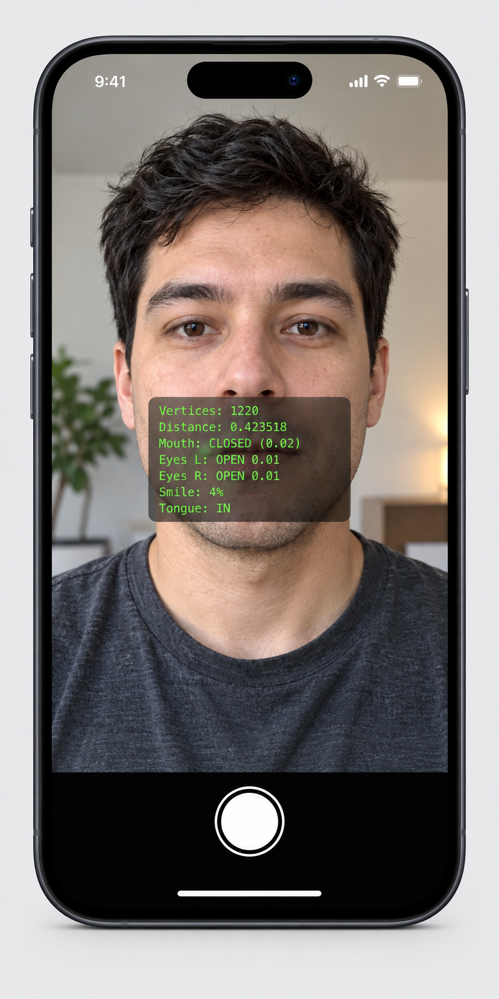
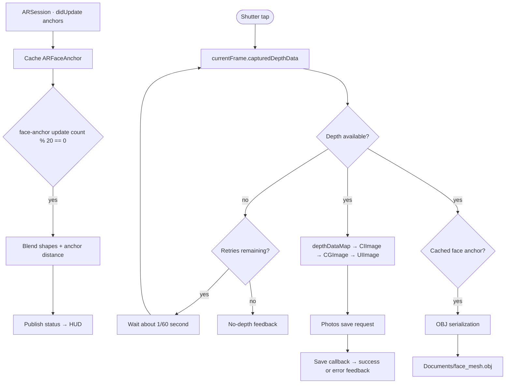

<div align="center">

# ARFaceDumper

**Real-time facial capture, mesh export and depth acquisition for iOS.**

[](https://developer.apple.com/ios/)
[](https://swift.org)
[](https://developer.apple.com/augmented-reality/arkit/)
[](LICENSE)

<p align="center">
  
  <br>
  <em>Illustrative main view with a generated portrait and sample telemetry.</em>
</p>

</div>

---

## Table of Contents

- [Overview](#overview)
- [Features](#features)
- [Requirements](#requirements)
- [Installation](#installation)
- [Configuration](#configuration)
- [Usage](#usage)
- [Output Artifacts](#output-artifacts)
- [Architecture](#architecture)
- [Tracked Blend Shapes](#tracked-blend-shapes)
- [Project Structure](#project-structure)
- [Limitations](#limitations)
- [License](#license)

---

## Overview

ARFaceDumper is an iOS application built on **ARKit Face Tracking** that displays facial geometry and expression telemetry in real time. On a shutter tap, it attempts to save an **image derived from the depth map** to Photos and export the latest cached face mesh as a **Wavefront OBJ** file in the app’s Documents directory. Mesh export requires depth data to be available and a face anchor to have been cached. The app does not export the raw numeric depth buffer or record a continuous stream.

---

## Features

| Capability | Description |
| --- | --- |
| **Real-time face tracking** | `ARFaceTrackingConfiguration` driving a RealityKit `ARView` hosted inside SwiftUI via `UIViewRepresentable`. |
| **Live telemetry HUD** | Monospaced overlay refreshed every 20 face-anchor updates with vertex count, anchor-translation magnitude and expression states. |
| **Repositionable overlay** | The HUD can be dragged anywhere on screen and retains its position between gestures. |
| **One-tap capture** | A shutter button attempts depth-image saving and, once depth is available, cached mesh export; missing depth is retried up to 10 times. |
| **OBJ mesh export** | Writes vertices (`v`), texture coordinates (`vt`) and triangle faces (`f v/vt`) derived from `ARFaceGeometry`. |
| **Depth map capture** | Converts `capturedDepthData.depthDataMap` into an image and saves it to the Photos library. |
| **Capture feedback** | A transient banner reports Photos save success, Photos save errors, or exhausted depth retries. It does not report OBJ export status. |
| **On-device file access** | `UIFileSharingEnabled` and `LSSupportsOpeningDocumentsInPlace` expose exported meshes through Finder and the Files app. |

---

## Requirements

| Requirement | Value |
| --- | --- |
| Hardware | Physical iPhone or iPad with a TrueDepth camera that can run the deployment target |
| Development tools | Xcode with an iOS SDK and device support compatible with the deployment target |
| Deployment target | iOS 26.2 |
| Language mode | Swift 5 (`SWIFT_VERSION = 5.0`); this is not a requirement to use the Swift 5.0 compiler |
| Device families | iPhone, iPad |
| Frameworks | ARKit, RealityKit, SwiftUI, SwiftData, Core Image |

> [!IMPORTANT]
> Use a physical TrueDepth device to exercise face tracking and depth capture. The app starts the face-tracking session unconditionally and has no unsupported-device or Simulator fallback.

---

## Installation

```bash
git clone https://github.com/davidemonnati/ARFaceDumper.git
cd ARFaceDumper
open ARFaceDumper.xcodeproj
```

1. Open the project in Xcode.
2. Under **Signing & Capabilities**, select your development team. The bundle identifier defaults to `com.davidemonnati.ARFaceDumper`.
3. Complete the [configuration](#configuration) step below.
4. Select a connected TrueDepth device and run.

---

## Configuration

The project generates its final `Info.plist` using build settings and the checked-in plist. Two privacy strings are empty in both Debug and Release. **Populate both before running camera and Photos workflows** in the app target’s build settings:

| Build setting | Purpose |
| --- | --- |
| `INFOPLIST_KEY_NSCameraUsageDescription` | Front-camera access; for example: “Use the camera to track your face and capture its geometry.” |
| `INFOPLIST_KEY_NSPhotoLibraryAddUsageDescription` | Saving depth images; for example: “Save captured depth images to your photo library.” |

The checked-in [Info.plist](ARFaceDumper/Info.plist) additionally enables `UIFileSharingEnabled` and `LSSupportsOpeningDocumentsInPlace` so that exported meshes are reachable from the host machine.

---

## Usage

1. Launch the app and grant camera access.
2. Frame a face with the front camera. The overlay transitions from `Waiting for the face...` to a live readout after 20 face-anchor updates.
3. Drag the overlay to reposition it if it obscures the preview.
4. Tap the shutter button to capture and allow Photos additions when requested. If depth is unavailable, the app retries up to 10 times at approximately 1/60-second intervals.
5. Watch for a banner: `✅ Image saved`, `⚠️ No depth data yet, try again`, or `❌ Save failed: …`. Feedback is scheduled to clear after about two seconds. “Image saved” confirms only the Photos save, not the OBJ write.
6. Retrieve the artifacts as described below.

---

## Output Artifacts

| Artifact | Format | Destination | Retrieval |
| --- | --- | --- | --- |
| Face mesh | Wavefront OBJ (`face_mesh.obj`) | App `Documents` directory | Finder (device → Files) or the Files app |
| Depth image | `depthDataMap` rendered through `CIImage` → `CGImage` → `UIImage` | Photos library | Photos app |

The depth image is rendered without explicit normalization or tone mapping. No raw depth array, calibration data, or explicit image file format is exported.

The OBJ writes geometry vertices directly in the face anchor’s local coordinate system, without applying the anchor transform. UV coordinates and one-based triangle indices are included; normals, materials, and a camera texture are not.

Example of the generated OBJ structure (ellipses indicate omitted lines):

```obj
# ARFaceAnchor OBJ Export
o Face

v 0.0123 -0.0456 0.0789
...
vt 0.5012 0.4988
...
f 1/1 2/2 3/3
```

> [!NOTE]
> The mesh is always written to the same filename, so each capture replaces the previous export.

---

## Architecture

### Components

| Type | Role |
| --- | --- |
| `ARFaceDumperApp` | Application entry point; instantiates the SwiftData `ModelContainer`. |
| `ContentView` | SwiftUI composition: AR preview, draggable telemetry overlay, shutter control. |
| `ARFaceSceneView` | `UIViewRepresentable` bridge that constructs the `ARView` and starts the face-tracking session. |
| `ARSceneView` | `ARSessionDelegate` and `ObservableObject`; ingests `ARFaceAnchor` updates, publishes status text, and performs depth and mesh export. |
| `CaptureFeedback` | Success, missing-depth and Photos-error messages shown by the transient banner. |
| `Item` | SwiftData model retained from the project template; not yet part of the capture pipeline. |

### Capture Pipeline


```mermaid
flowchart TD
    A["ARSession · didUpdate anchors"] --> B["Cache ARFaceAnchor"]
    B --> C{"face-anchor update count % 20 == 0"}
    C -- yes --> D["Blend shapes + anchor distance"]
    D --> E["Publish status → HUD"]

    F(["Shutter tap"]) --> G["currentFrame.capturedDepthData"]
    G --> Q{"Depth available?"}
    Q -- no --> R{"Retries remaining?"}
    R -- yes --> S["Wait about 1/60 second"]
    S --> G
    R -- no --> T["No-depth feedback"]
    Q -- yes --> H["depthDataMap → CIImage → CGImage → UIImage"]
    H --> I["Photos save request"]
    I --> U["Save callback → success or error feedback"]
    Q -- yes --> J{"Cached face anchor?"}
    J -- yes --> K["OBJ serialization"]
    K --> L["Documents/face_mesh.obj"]
```

Telemetry is published every 20 face-anchor updates, while the anchor is cached on every received update. The mesh uses that cached anchor; the code does not synchronize it with the depth frame or clear it when tracking is lost. A missing current frame returns immediately without feedback. Once depth is available, OBJ writing proceeds without waiting for the asynchronous Photos save result.

---

## Tracked Blend Shapes

| Metric | ARKit blend shape(s) | Reported as |
| --- | --- | --- |
| Mouth | `jawOpen` | `OPEN` above 0.20, otherwise `CLOSED` |
| Left eye | `eyeBlinkLeft` | `CLOSED` above 0.30, otherwise `OPEN` |
| Right eye | `eyeBlinkRight` | `CLOSED` above 0.30, otherwise `OPEN` |
| Smile | `mouthSmileLeft`, `mouthSmileRight` | Mean of both channels, as a percentage |
| Tongue | `tongueOut` | `OUT` above 0.50, otherwise `IN` |
| Distance | `ARFaceAnchor.transform` | Euclidean norm of the translation column, in meters; no camera-relative transform is computed |
| Vertices | `ARFaceGeometry.vertices` | Vertex count of the current mesh |

---

## Project Structure

```text
ARFaceDumper/
├── ARFaceDumperApp.swift     # Entry point and SwiftData container
├── ContentView.swift         # UI, AR session delegate, capture and export logic
├── Item.swift                # SwiftData model
├── Info.plist                # File-sharing keys
└── Assets.xcassets/          # App icon and accent color
ARFaceDumperTests/            # Unit tests
ARFaceDumperUITests/          # UI and launch tests
ARFaceDumper.xcodeproj/       # Xcode project
```

---

## Limitations

- Missing depth is retried up to 10 times after the initial attempt. If it remains unavailable, a banner appears and neither artifact is exported. Mesh export is not independently available.
- There is no support check or AR-session failure/interruption UI. A missing current frame or failed image conversion returns without feedback.
- Cached face geometry and telemetry are not cleared when tracking is lost, and mesh/depth samples are not explicitly synchronized.
- The depth buffer is converted without normalization or tone mapping, so the saved image is not optimized for visual inspection.
- OBJ export uses a fixed filename and omits vertex normals and material definitions.
- Failures while writing the OBJ file are silently discarded.

---

## License

Distributed under the **BSD 3-Clause License**. See [LICENSE](LICENSE) for the full text.

Copyright © 2026 Davide Monnati.
